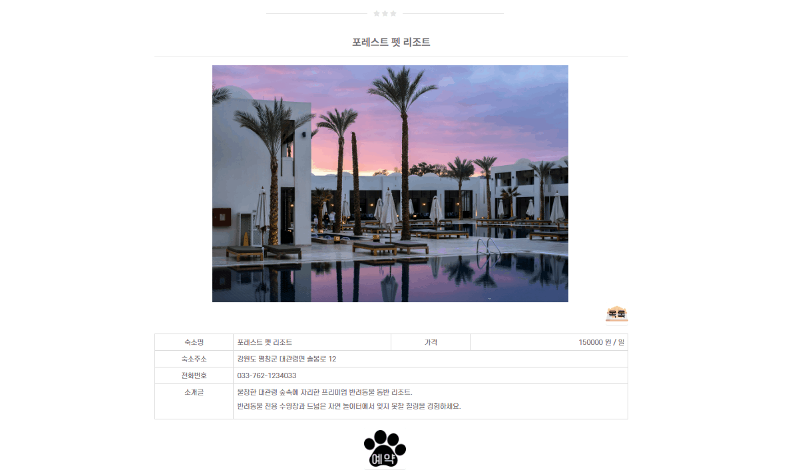
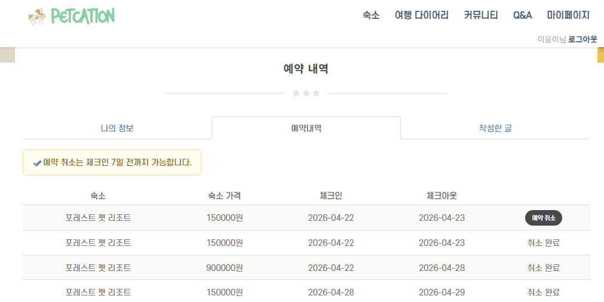

## 🐶 펫케이션
> 반려동물 동반 숙박 예약 플랫폼
> - 개발 기간: 2022.07 ~ 2022.08 / 2026.04 결제 시스템 개선
> - 개발 인원: 5인 (팀장 · 예약/결제 담당)
>   
> 기존 팀 프로젝트에서 담당했던 예약/결제 기능을 
> 토스페이먼츠 API로 전면 개선하고 결제 보안 및 예외 처리를 강화했습니다.

 

## 🐤 기술스택
- Backend: Java, Spring MVC, MyBatis
- Frontend: JavaScript, HTML5, CSS3
- Database/Server: Oracle, Tomcat
- 외부 API: 토스페이먼츠

 

## 서비스 화면

### 예약 및 결제
- 숙소 조회 및 날짜 선택
- 예약자 정보 입력 및 토스페이먼츠 연동 결제

### 예약 취소
- 예약 내역 조회 및 취소

 

## 프로세스 흐름
### 결제 프로세스

**1. 결제 버튼 클릭**
- 유효성 검사 (validateReservation)

**2. /payments/create POST**
- 예약 정보 검증 (validateOrder)
- 가격 계산 (calculatePrice)
- payments 테이블 INSERT (status: READY)
- reserv 테이블 INSERT (status: READY)
- orderId, price 반환

**3. 토스 결제창**
- 카드 인증

**4. /payments/success 리다이렉트**
- 금액 위변조 검증
- 중복결제 검증
- 토스 승인 API 호출
- payments UPDATE (status: DONE)
- reserv UPDATE (status: DONE)
- success 페이지 반환

**5. 실패 시**
- reserv 페이지로 redirect + errorMessage

 

### 취소 프로세스

**1. 예약 취소 버튼 클릭**
- 체크인 7일 전 여부 클라이언트 사전 검증

**2. /payments/{orderId}/cancel PATCH**
- 취소 가능 여부 검증 (validateCancellation)
  - 본인 예약 여부 확인
  - 이미 취소된 예약 여부 확인
  - 체크인 7일 전 기한 확인

**3. 토스 결제 취소 API 호출**
- payments 테이블 UPDATE (status: CANCELED)
- reserv 테이블 UPDATE (status: CANCELED)

 

## 기술적 고민

### 1️⃣ 결제 전후 금액 검증으로 위변조 방지
**배경:** 클라이언트 측에서 전달되는 결제 금액은 위변조될 위험이 있으며 서비스의 직접적인 금전적 손실로 이어질 수 있음을 인지

**해결:** 결제 승인 전후로 나누어 검증하는 2단계의 로직 구현.
- 사전 검증: 결제창 호출 전, 서버에서 숙소 가격을 재계산하여 DB에 READY 상태로 저장 후 고유 orderId 발급.
- 사후 검증: 토스 승인 API 호출 직전, 실제 승인 요청 금액이 DB에 기록된 사전 검증 금액과 일치하는지 최종 확인.

**성과:** 결제 데이터 무결성을 확보 및 결제 시스템의 신뢰도 향상.

 

### 2️⃣ 취소 정책 및 예외 처리
**배경:** 취소 요청 시 발생할 수 있는 권한 오용, 중복 요청 등 다양한 예외 상황을 사전에 방어할 필요성 인지
- 체크인 7일 전 취소 기한 검증을 서버/클라이언트 양쪽에서 이중 처리
- 본인 예약 여부, 이미 취소된 예약 재취소 방지 등 엣지 케이스 처리
- 취소 버튼 disabled 처리로 중복 요청 방지

 

