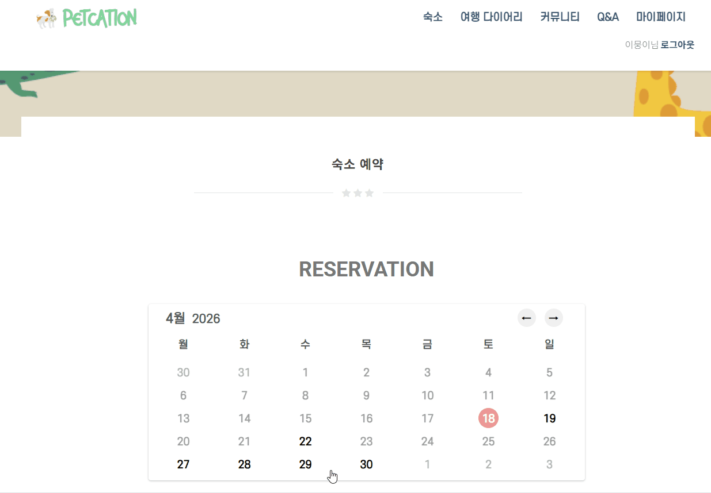
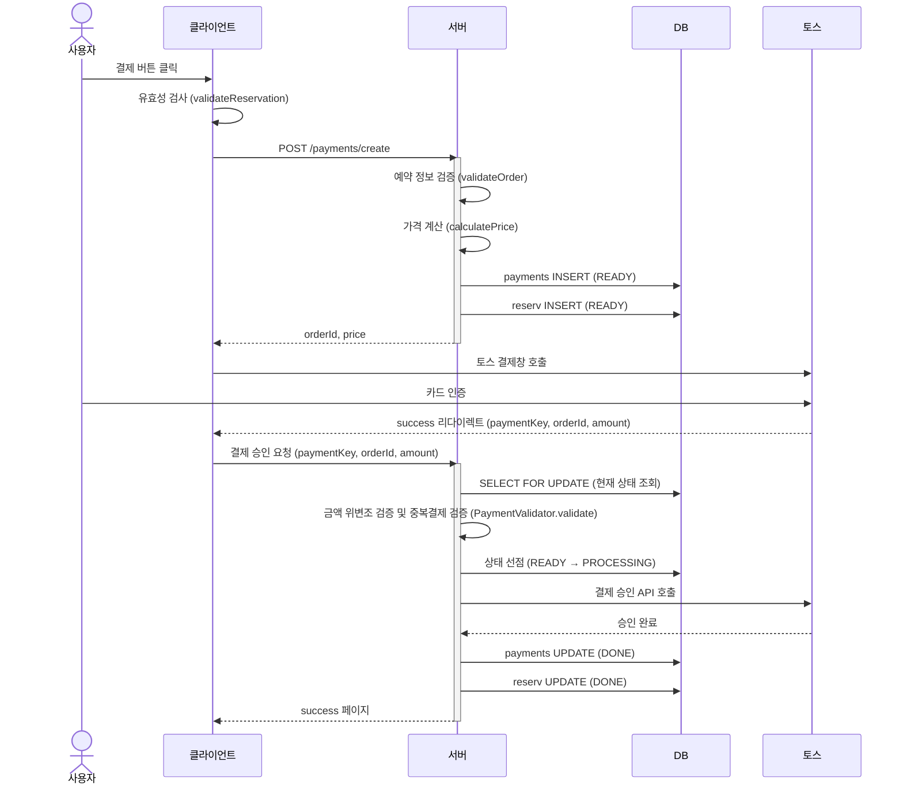
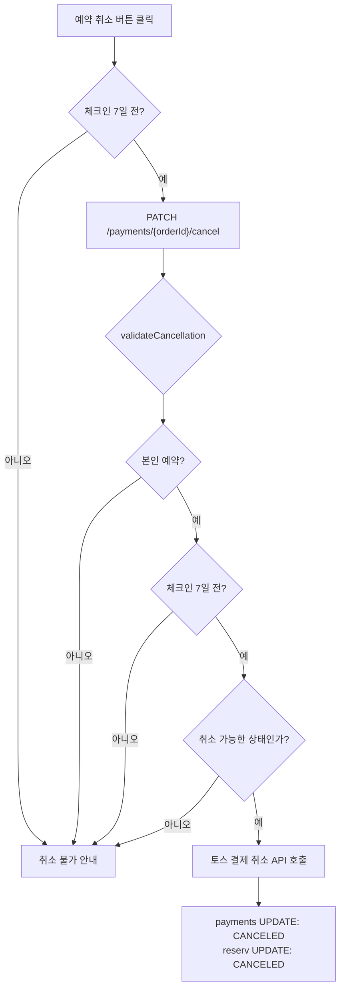
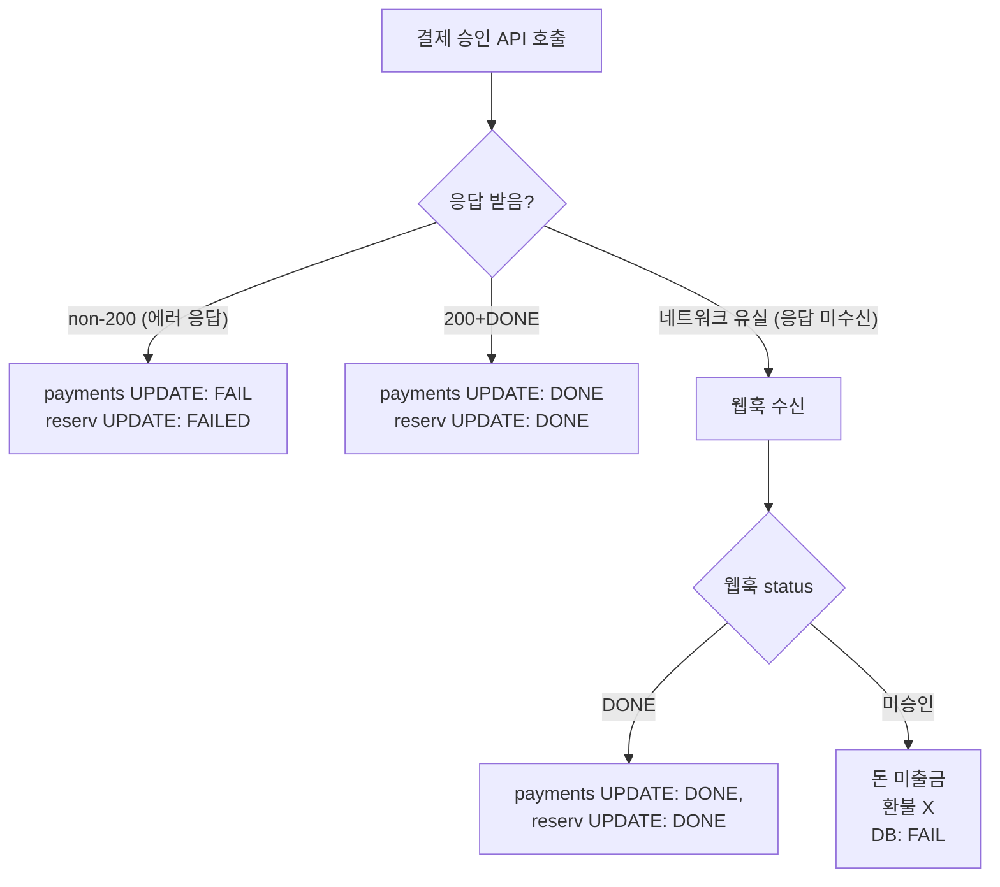

### 

## 🐶 펫케이션

> 반려동물 동반 숙박 예약 플랫폼
> 
> - 개발 기간: 2022.07 ~ 2022.08 최초 개발 / 2026.03 ~ 2026.07 예약·결제 시스템 개선
> - 개발 인원: 5인 (팀장 · 예약·결제 담당)
> 
> 기존 팀 프로젝트에서 담당했던 예약·결제 기능을
> 토스페이먼츠 API로 전면 개선하고 결제 보안 및 예외 처리를 강화했습니다.
> 

 

## 🐤 기술스택

- Backend: Java, Spring MVC, MyBatis
- Frontend: JavaScript, HTML5, CSS3
- Database/Server: Oracle, Tomcat
- 외부 API: 토스페이먼츠

 

## 서비스 화면

### 예약 및 결제

- 숙소 조회 및 날짜 선택
- 예약자 정보 입력 및 토스페이먼츠 연동 결제

 

### 예약 취소

- 예약 내역 조회 및 취소

 

### 결제 실패

- 결제 승인 실패 시 에러 메시지 안내
- 웹훅 중복 수신 방어로 2중 안전장치 구현

 

## 프로세스 흐름

### 결제 프로세스

#### 전체 흐름

**1. 결제 버튼 클릭**

- 유효성 검사 (validateReservation)

**2. POST /payments/create**

- 예약 정보 검증 (validateOrder)
- 가격 계산 (calculatePrice)
- payments 테이블 INSERT (status: READY)
- reserv 테이블 INSERT (status: READY)
- orderId, price 반환

**3. 토스 결제창**

- 카드 결제
- /payments/success 리다이렉트

**4. 결제 승인 요청**

- 금액 위변조 검증 및 중복결제 검증
- 검증 통과 시 상태 선점 (READY → PROCESSING)
- 토스 승인 API 호출
- payments UPDATE (status: DONE)
- reserv UPDATE (status: DONE)
- success 페이지 반환

### 

 

### 취소 프로세스

**1. 예약 취소 버튼 클릭**

- 클라이언트 사전 검증: 체크인 7일 전 여부

**2. /payments/{orderId}/cancel PATCH**

- 취소 가능 여부 검증 (validateCancellation)
    - 본인 예약 여부 확인
    - 체크인 7일 전 기한 확인
- 취소 가능한 상태(DONE)라면 선점 (claimForCancel)

**3. 토스 결제 취소 API 호출**

- payments 테이블 UPDATE (status: CANCELED)
- reserv 테이블 UPDATE (status: CANCELED)

 

### 토스 API 흐름

**결제 승인 결과 처리**

토스페이먼츠 승인 API는 200 OK 응답일 때만 실제 출금이 발생합니다. 이를 기준으로 응답을 세 가지로 나눠 처리합니다.

- **200 + DONE:** 정상 승인. 출금이 완료된 상태이므로 상태값을 DONE으로 갱신합니다.
- **non-200 (에러 응답):** 승인이 거절된 상태로 출금되지 않습니다. 따라서 환불할 대상이 없으며 상태값을 FAIL로 갱신합니다.
- **네트워크 유실 (응답 미수신):**  출금 여부를 응답으로 확인할 수 없습니다. 토스가 별도로 전송하는 웹훅(`PAYMENT_STATUS_CHANGED`)을 통해 최종 상태를 확인하여 처리합니다. 웹훅의 status가 DONE이면 정상 완료, 미승인 상태면 출금이 없으므로 환불 없이 FAIL로 갱신합니다.

> 결제 성공 처리는 승인 API 응답과 웹훅 수신(백업 경로) 두 갈래로 들어올 수 있으며 두 경로 모두 동일한 검증 로직(`PaymentValidator.validate`)을 이용하여 중복 처리되지 않도록 했습니다.
> 

 

## 기술적 고민

### 1️⃣ 결제 전후 이중 금액 검증으로 위변조 방지

**배경:** 클라이언트 측에서 전달되는 결제 금액은 위변조될 위험이 있으며 서비스의 직접적인 금전적 손실로 이어질 수 있음을 인지.

**해결:** 결제 승인 전후로 나누어 검증하는 2단계의 로직 구현.

- 사전 검증: 결제창 호출 전, 서버에서 숙소 가격을 재계산하여 DB에 READY 상태로 저장 후 고유 orderId 발급.
- 사후 검증: 토스 승인 API 호출 직전, 실제 승인 요청 금액이 DB에 기록된 사전 검증 금액과 일치하는지 최종 확인.

**성과:** 결제 데이터 무결성 확보 및 결제 시스템 신뢰도 향상.

 

### 2️⃣ 결제 실패 및 예외 상황 대응을 통한 데이터 무결성 확보

**배경:** 결제 승인 과정에서 네트워크 오류, 데이터베이스 갱신 실패, 비정상적인 결제 요청 등 다양한 예외 상황이 발생할 수 있으며 이로 인한 결제 상태와 예약 상태가 불일치하는 정합성 문제를 방지할 필요성 인지.

**해결:**

- 웹훅을 통한 상태 동기화: 결제 승인 응답을 받지 못하는 통신 오류를 대비해 토스 페이먼츠 웹훅을 통해 결제 상태를 실시간 수신하여 데이터 누락 방지.
- 멱등성 보장: DB 비관적 락으로 결제 상태를 확인하고 유효한 경우 `PROCESSING`으로 상태를 선점하여 중복 결제 승인이나 중복 웹훅 요청을 방지.
- 출금 상태 기반 실패 처리: 토스 승인 API는 200 OK일 때만 실제 출금이 발생함을 확인. non-200는 출금되지 않은 상태이므로 환불 호출 없이 상태값만 FAIL로 갱신.

**성과:** 데이터 불일치 위험을 최소화하는 방어 로직 구현.

 

### 3️⃣ 취소 정책 및 예외 처리

**배경:** 취소 요청 시 발생할 수 있는 권한 오용, 중복 요청 등 다양한 예외 상황을 사전에 방어할 필요성 인지

**해결:**

- 체크인 7일 전 취소 기한 검증을 서버와 클라이언트에서 이중 확인.
- 취소 가능 상태(DONE)를 화이트리스트 방식으로 검증, 취소 처리 중(CANCEL_PROCESSING) 상태를 선점하여 중복 취소 요청 방지.
- 취소 실패 시 상태를 원래대로 복구. (네트워크 유실로 인한 실패는 실제 취소 여부가 불확실하므로 복구하지 않고 별도 확인이 필요.)
- 본인 예약 여부 확인 등 엣지 케이스 처리.
- 취소 버튼 disabled로 중복 요청 방지.

### 

 

**개선 사항:** 

1. **데이터 정합성 보정**: 토스 결제는 성공했으나 DB 갱신이 실패하면 결제·예약 상태가 불일치할 수 있음. 모니터링으로 불일치 건을 탐지하고 스케줄링 배치를 통해 주기적으로 보정 필요.
2. **UX:** 결제 중 네트워크 응답 유실 시 사용자 화면엔 실패로 표시되지만 웹훅으로 결제가 정상 처리될 수 있음. 이 경우 사용자가 결제·예약 성공 여부를 즉시 알 수 없는 문제가 있음. 
→ 결제 결과 폴링 또는 마이페이지 안내·알림으로 사용자에게 최종 상태를 전달하도록 보완 필요.
3. **결제 상태 설계 보완 및 재확인 로직 보완**: confirm/cancel 요청 중 네트워크 유실로 응답을 받지 못한 경우는 실패와 동일하게 처리됨. 실제로는 결제 API의 처리가 완료됐을 가능성이 있어, 결과 미확인 케이스를 별도 상태(UNKNOWN)로 남기고, 토스 결제 조회 API(GET /v1/payments/{paymentKey})로 실제 상태를 재확인하는 배치 또는 관리자 도구를 추가해 정합성 보완 필요.
4. ~~**동시성 제어**~~: 초기엔 `@Transactional` + `SELECT FOR UPDATE`로 confirm 요청의 동시성을 제어했으나, Toss API 응답을 기다리는 동안 DB 락이 유지되어 락 보유 시간이 외부 API 응답 속도에 종속되는 문제 발생. 이를 피하려 트랜잭션을 제거했으나 중복 처리 가능성이 남는 트레이드오프 발생. 
**→ 해결**: 락을 짧게 걸어 상태만 `PROCESSING`으로 선점 후 즉시 해제하고, 외부 API 호출은 락 밖에서 수행하는 방식으로 재설계. DB 비관적 락 + 상태 선점 조합으로 confirm/webhook 동시 요청 시 중복 처리 방지 완료. 
**향후 고도화**: 현재는 단일 서버 기준 DB 락으로 충분하나, 다중 인스턴스로 확장 시 DB 락만으로는 한계가 있어 Redisson 등 분산 락 도입 검토 필요.
